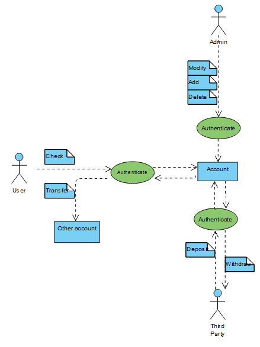
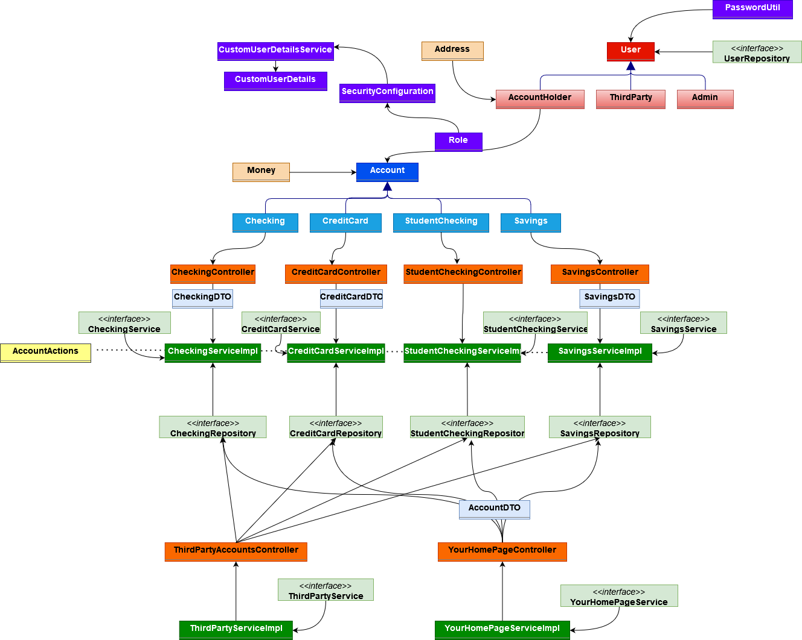

Please read the important note before launching the application from spring-boot run

User case Diagram

Class diagram

There are 4 types of accounts, Checking, studentChecking Credit Card, Savings. They innherit the class Account
There are 3 types of users: Admin, AccountHolder, and ThirdParty. They inherit the class User

Each User has a Role, a username and a Password that are used by Spring security to access the routes

Each account has a Repository, controller, and Service in order to do transfers, get, update and delete information.

-Third party users have an extra Service and Controller, in order to transfer funds to an existing accounts in a route
-Accountholders have an extra Service and Controller, to get general info about all their accounts.

There is a class called AccountActions with general methods like finding an account class, checking funds, etc.

IMPORTANT: in AccountActions (Service->Utils) there is a method annotated with @PostConstruct.
This method populates the database with several users an creates some accounts. The annotation "@PostConstruct" should be commented out or deleted after executing the app, otherwise it will create repeated users and accounts. In other words, it should be executed only once.